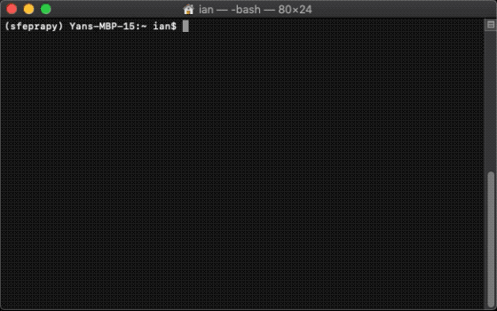
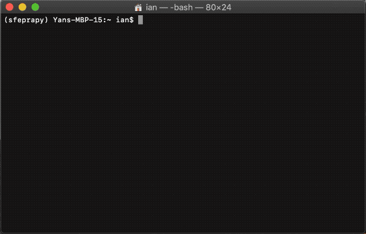
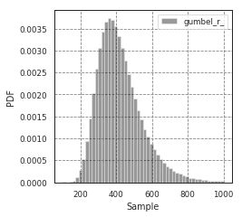
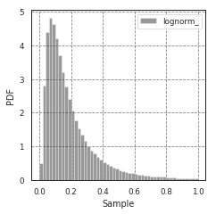
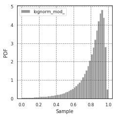
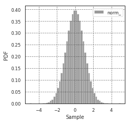
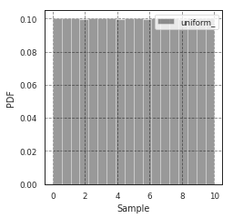

# SfePrapy

Structural fire engineering (Sfe) probabilistic reliability assessment (Pra) in python (py) - is a probabilistic analysis tool that estimates the structural reliability for given scenarios (such as enclosure geometry, building type, window areas etc.) against equivalent time exposure to the ISO 834 fire curve.

## Getting Started

Python 3.7 or later is required.

### Installation

pip is a package management system for installing and updating Python packages. pip comes with Python, so you get pip simply by installing Python. On Ubuntu and Fedora Linux, you can simply use your system package manager to install the `python3-pip` package. [The Hitchhiker's Guide to Python](https://docs.python-guide.org/starting/installation/) provides some guidance on how to install Python on your system if it isn't already; you can also install Python directly from [python.org](https://www.python.org/getit/). You might want to [upgrade pip](https://pip.pypa.io/en/stable/installing/) before using it to install other programs.



1. to use `pip` install from PyPI:

    ```sh
    pip install --upgrade sfeprapy
    ```

2. to use `pip` install from GitHub (requires [git](https://git-scm.com/downloads)):

    ```sh
    pip install --upgrade "git+https://github.com/fsepy/SfePrapy.git@master"
    ```

### Usage

#### MCS for structural PRA method 0: `sfeprapy.mcs0`



Idealised Monte Carlo Simulation processes:

1. PROBLEM DEFINITION;
2. SAMPLE INPUTS;
3. ITERATIVE CALCULATION; and
4. POST-PROCESSING.

To run `sfeprapy.mcs0` from source (or when it is installed via, i.e. pip):

```sh
python -m sfeprapy.mcs0
```

A window will be popped up asking for input a input / problem definition file. The input file should be in '.csv' or '.xlsx' format. Structure of the input file is addressed in the following paragraphs.

When a configuration file with the name 'config.json' is provided in the same directory, the program will attempt to read it and use parameters contained therein. Number of threads (multi-processing) along with few other parameters can be defined in this file.

Once the input file is selected, the program will take the lead and run calculations until all simulations are complete. Results will be saved in the same folder. Conveniently, the software has the feature of displaying the progress and some statistics as per below.

```
CASE                    : Standard Case 1
NO. OF THREADS          : 4
NO. OF SIMULATIONS      : 1000
100%|███████████████████| 1000/1000 [00:09<00:00, 86.15it/s]
fire_type               : {0: 23, 1: 977}
beam_position_horizontal: -1.000    27.534    28.646
fire_combustion_efficien: 0.800     0.900     1.000
fire_hrr_density        : 0.240     0.250     0.260
fire_load_density       : 10.000    420.399   1500.000
fire_nft_limit          : 623.150   1323.150  2023.152
fire_spread_speed       : 0.004     0.011     0.019

CASE                    : Standard Case 2
NO. OF THREADS          : 4
NO. OF SIMULATIONS      : 1000
100%|███████████████████| 1000/1000 [00:10<00:00, 77.85it/s]
fire_type               : {0: 10, 1: 990}
beam_position_horizontal: -1.000    27.943    28.646
fire_combustion_efficien: 0.800     0.900     1.000
fire_hrr_density        : 0.240     0.250     0.260
fire_load_density       : 10.000    420.399   1500.000
fire_nft_limit          : 623.150   1323.150  2023.152
fire_spread_speed       : 0.004     0.011     0.019
```

##### Input Parameters

Example input template can be found at:

- `sfeprapy.mcs0.EXAMPLE_CONFIG_DICT`: Example configuration file, `dict` object;
- `sfeprapy.mcs0.EXAMPLE_INPUT_DICT`: Example input file, `dict` object; and
- `sfeprapy.mcs0.EXAMPLE_INPUT_CSV`: Example input file, `str` in csv format.

For example, to produce an example input file:

```python
>>> import sfeprapy
>>> print(sfeprapy.mcs0.EXAMPLE_INPUT_CSV)
```

Copy the printed string (as per below) to a text file and replace the '.txt' extension with '.csv'.

```shell
PARAMETERS,Standard Case 1,Standard Case 2
beam_cross_section_area,0.017,0.017
beam_position_horizontal,-1,-1
beam_position_vertical,3.2,3.2
beam_rho,7850,7850
case_name,Standard Case 1,Standard Case 2
...
```

The following table summarises the parameters that are required by `sfeprapy.mcs0` module.

###### Non-Optional Miscellaneous Parameters

`case_name`: str
> A name for the case/compartment. Should be unique among all cases. This may be used in post-processing when combining time equivalence results.

`fire_mode`: int
> Should be an integer from 0 to 4, inclusive.
> To define what design fires to use:  
> 0 - EC parametric fire only;  
> 1 - Travelling fire only;  
> 2 - EC parametric fire, German Annex;  
> 3 - Option 0 and 1 as above; or  
> 4 - Option 2 and 2 as above.  

`n_simulations`: int
> Should be an integer greater or equal to1.
> The number of simulations that will be running. A sensitivity analysis should be carried out to determine the appropriate number of simulations.

`probability_weight`: float
> Should be a real number between 0 and 1, inclusive.
> The fire occurrence probability weight of this specific case (i.e. compartment) among all cases (i.e. entire building).
> This parameter is not used in any calculation. `sfeprapy.mcs0` reference this parameter in its output for each single iteration and can be used during post-processing to combine time equivalence curves based on their probability weight to the entire building.

###### Compartment Parameters

`room_breadth`: float
> [m]  
> Breadth of room (the shorter dimension).

`room_depth`: float

> [m]  
> Depth of room (the greater dimension).

`room_height`: float
> [m]  
> Height of room (floor slab to ceiling slab).

`room_wall_thermal_inertia`: float
> [J/m²/K/√s]  
> Compartment lining thermal inertia.

`window_width`: float
> [m]  
> Total width of all opening areas for a compartment.

`window_height`: float
> [m]  
> Weighted height of all opening areas.

`beam_position_vertical` : float

> [m]  
> Height of test structure element within the compartment for TFM. This can be altered to assess the influence of height in tall compartments. Need to assess worst case height for columns.

`beam_position_horizontal`: float

> [m]  
> Minimum beam location relative to compartment length for TFM - Linear distribution.

###### Windows/Natural Vent

`window_open_fraction`: float

> Dimensionless.  
> Glazing fall-out fraction.

`window_open_fraction_permanent`: float

> Dimensionless.  
> Use this to force a ratio of open windows. If there is a vent to the outside this can be included here.

###### Design Fire Parameters

`fire_tlim`: float
> [hour]  
> Time for maximum gas temperature in case of fuel-controlled fire, value options can be found in Annex A EN 1991-1-2.
> Slow: 25/60
> Medium: 20/60
> Fast: 15/60

`fire_time_step`: float

> [s]  
> Time step used for the model, all fire time-temperature curves and heat transfer calculation. This is recommended to be less than 30 s.

`fire_time_duration`: float
> [s]  
> End of simulation. This should be set so that output data is produced allowing the target reliability to be determined. Normally set it to 4 hours and longer period of time for greater room length in order for travelling fire to propagate the entire room.

`fire_load_density`: float

> [MJ/m²]  
> Fire load density. This should be selected based on occupancy characteristics. See literature for typical values for different occupancies.

`fire_hrr_density`: float

> [MW/m²]  
> Heat release rate. This should be selected based on the fuel. See literature for typical values for different occupancies.

`fire_spread_speed`: float

> [m/s]  
> Min spread rate for travelling fire.

`fire_nft_limit`: float

> [K]  
> TFM near field temperature.

`fire_combustion_efficiency`: float

> Dimensionless.  
> Combustion efficiency.

`fire_gamma_fi_q`: float

> Dimensionless.  
> The partial factor for EC fire (German Annex).

`fire_t_alpha`: float
> [s]  
> The fire growth factor.

###### Structural Element Section Properties

`beam_cross_section_area`: float,

> [m²]  
> Cross sectional area of the section.

`beam_rho`: float
> [kg/m³]  
> Density of the structural member.

`beam_temperature_goal`: float
> [K]  
> Structural element (steel) failure temperature in Kelvin for goal seek.

`protection_protected_perimeter`: float

> [m]  
> Heated perimeter.

`beam_protection_thickness`: float

> [m]  
> Thickness of protection.

`protection_k`: float

> [W/m/K]  
> Protection conductivity.

`protection_rho`: float
> [kg/m³]  
> Density of protection to beam.

`protection_c`: float
> [J/kg/K]  
> Specific heat of protection

###### Solver Settings (for Time Equivalence)

`solver_temperature_goal`: float
> [K]  
> The temperature to be solved for. This is critical temperature of the beam structural element, i.e. 550 or 620 °C.

`solver_max_iter`: float

> Dimensionless.  
> The maximum iteration for the solver to find convergence. Suggest 20 as most (if not all) cases converge in less than 20 iterations.

`solver_thickness_lbound`: float

> [m]  
> The smallest value that the protection thickness can be. This is used to solve the maximum steel temperature at `solver_temperature_goal`.

`solver_thickness_ubound`: float
> [m]  
> The greatest value that the protection thickness can be. This is used to solve the maximum steel temperature at `solver_temperature_goal`.

`solver_tol`: float

> [K]  
> Tolerance of the temperature to be solved for. Set to 1 means convergence will be satisfied when the solved value is greater than `solver_temperature_goal-1` and less than `solver_temperature_goal+1`.

`phi_teq`: float
> Dimensionless.  
> Model uncertainty factor multiplied with the evaluated characteristic time equivalence value to get the design time equivalence value.

###### Timber Properties

`timber_exposed_area`: float
> [m²]  
> Exposed timber surface within the compartment. Set `timber_exposed_area` to '0' to omitt timber involvement.

`timber_charring_rate`: float
> [mm/min]  
> Timber constant charring rate. This is currently independent of temperature or heat flux.

`timber_hc`: float
> [MJ/kg]  
> Heat of combustion of timber.

`timber_density`: float
> [kg/m³]  
> Density of timber.

`timber_solver_ilim`: float
> Dimensionless.  
> The maximum number of iterations that the solver can run. `timber_solver_iter` in the output file should be inspected to determine appropriate value for `timber_solver_ilim`. Consider to increase `timber_solver_ilim` (or increase `timber_solver_tol`) if many solved values have `timber_solver_iter` == `timber_solver_ilim`.

`timber_solver_tol`: float
> [s]  
> Tolerance of the solver. Convergence is sought if change in time equivalence is less than `timber_solver_tol`.

## Available Distributions

To set the `fire_load_density` as a constant in the problem definition file:

| PARAMETERS        | Example Case |
| ----------------- | ------------ |
| ⋮                 | ⋮            |
| fire_load_density | 400          |
| ⋮                 | ⋮            |

To set the `fire_load_density` as a stochastic variable ([gumbel_r](https://docs.scipy.org/doc/scipy/reference/generated/scipy.stats.gumbel_r.html#scipy.stats.gumbel_r) distribution) in the problem definition file:

| PARAMETERS               | Example Case |
| ------------------------ | ------------ |
| ⋮                        | ⋮            |
| fire_load_density:dist   | gumbel_r_    |
| fire_load_density:mean   | 420          |
| fire_load_density:sd     | 127          |
| fire_load_density:ubound | 2000         |
| fire_load_density:lbound | 50           |
| ⋮                        | ⋮            |

A full list of distributions are described in following sections.

### Gumbel distribution (right-skewed)



`dist`: str
> Set to 'gumbel_r_' for Gumbel Distribution (right-skewed).

`mean`: float
> True mean of the distribution.

`sd`: float
> True Standard Deviation of the distribution.

`ubound`: float
> Upper limit of the sampled values, i.e. the maximum value of the x-axis of a CDF.

`lbound`: float
> Lower limit of the sampled values, i.e. the minimum value of the x-axis of the CDF.

### Lognormal distribution



`dist`: str
> Set to 'lognorm_' for Lognormal Distribution.

`mean`: float
> True mean of the distribution.

`sd`: float
> True Standard Deviation of the distribution.

`ubound`: float
> Upper limit of the sampled values, i.e. the maximum value of the x-axis of a CDF.

`lbound`: float
> Lower limit of the sampled values, i.e. the minimum value of the x-axis of the CDF.

### Lognormal distribution (Modified)



This distribution gives 1-φ, where φ is a lognormal distribution.

`dist`: str

> Set to 'lognorm_mod_' for the modified lognormal distribution.

`mean`: float
> True mean of the distribution.

`sd`: float
> True Standard Deviation of the distribution.

`ubound`: float
> Upper limit of the sampled values, i.e. the maximum value of the x-axis of a CDF.

`lbound`: float
> Lower limit of the sampled values, i.e. the minimum value of the x-axis of the CDF.

### Normal distribution



`dist`: str
> Set to 'norm_' for Normal Distribution.

`mean`: float
> True mean of the distribution.

`sd`: float
> True Standard Deviation of the distribution.

`ubound`: float
> Upper limit of the sampled values, i.e. the maximum value of the x-axis of a CDF.

`lbound`: float
> Lower limit of the sampled values, i.e. the minimum value of the x-axis of the CDF.

### Uniform distribution



`dist`: str
> Set to 'uniform_' for uniform distribution.

`ubound`: float
> Upper limit of the values to be sampled, i.e. the maximum value of the x-axis of the distribution's CDF.

`lbound`: float
> Lower limit of the values to be sampled, i.e. the minimum value of the x-axis of the distribution's CDF.

## Limitations

To-do

## Authors

**Ian Fu** - *fuyans@gmail.com*  
**Danny Hopkin** - *danny.hopkin@ofrconsultants.com*  
**Ieuan Rickard** - *ieuan.rickard@ofrconsultants.com*

## License

This project is licensed under the MIT License - see the [LICENSE](LICENSE) file for details
