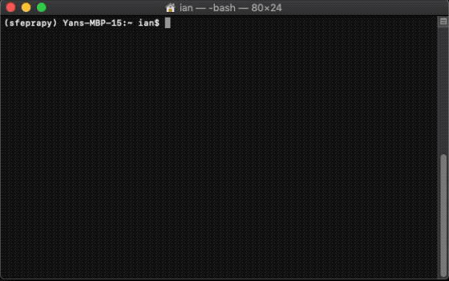
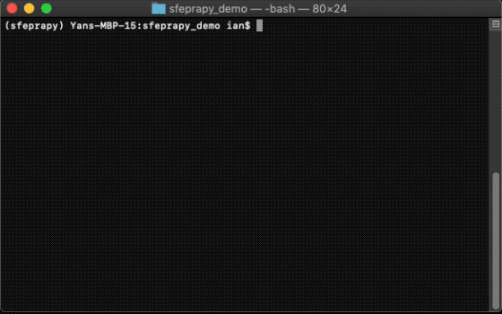
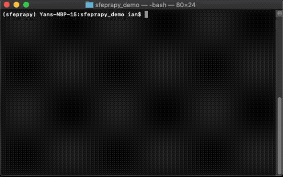

# SfePrapy

Structural fire engineering (Sfe) probabilistic reliability assessment (Pra) in python (py) - is a probabilistic analysis tool that estimates the appropriate fire resistance rating for structural elements using reliability based methods. All uncertainty is related to the thermal exposure, i.e. impacted by stochastic parameters dictating the design fire condition.

A publication summarising the capabilities can be found 

## Getting Started

Documentation can be found in the [wiki](https://github.com/fsepy/SfePrapy/wiki).

### Installation

[Python](https://www.python.org/downloads/) 3.7 or later is required. [Anaconda Distribution](https://www.anaconda.com/distribution/#download-section) is recommended for new starters, it includes Python and few useful packages.

pip is a package management system for installing and updating Python packages. pip comes with Python, so you get pip simply by installing Python. On Ubuntu and Fedora Linux, you can simply use your system package manager to install the `python3-pip` package. [The Hitchhiker's Guide to Python](https://docs.python-guide.org/starting/installation/) provides some guidance on how to install Python on your system if it isn't already; you can also install Python directly from [python.org](https://www.python.org/getit/). You might want to [upgrade pip](https://pip.pypa.io/en/stable/installing/) before using it to install other programs.

1. to use `pip` install from PyPI:

    [](https://pepy.tech/project/sfeprapy)
    [](https://badge.fury.io/py/sfeprapy)

    ```sh
    pip install --upgrade sfeprapy
    ```

2. to use `pip` install from GitHub (requires [git](https://git-scm.com/downloads)):  
    *Note installing `SfePrapy` via this route will include the lastest commits/changes to the library.*  

    []()

    ```sh
    pip install --upgrade "git+https://github.com/fsepy/SfePrapy.git@master"
    ```

    


### To produce an example input file

```python
>>> import sfeprapy.mcs0
>>> with open('example_input.csv', 'w') as f:
>>> 	f.write(sfeprapy.mcs0.EXAMPLE_INPUT_CSV)
```



### To produce an example configuration file

```python
>>> import json
>>> import sfeprapy.mcs0
>>> with open('config.json', 'w') as f:
>>> 	json.dump(sfeprapy.mcs0.EXAMPLE_CONFIG_DICT, f)
```



### To run `sfeprapy.mcs0` simulation

```shell
python -m sfeprapy.mcs0
```



## Authors

**Ian Fu** - *fuyans@gmail.com*  
**Danny Hopkin** - *danny.hopkin@ofrconsultants.com*  
**Ieuan Rickard** - *ieuan.rickard@ofrconsultants.com*

## License

This project is licensed under the MIT License - see the [LICENSE](LICENSE) file for details
